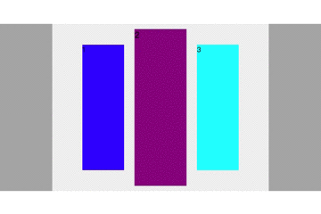

# Jquery 插件 - 3D 轮播图

Jquery 插件，3D 轮播图。亦可用于轮播的块。

## 效果图



## API

### html

html写法：

```html
<div class="carousel">
	<div class="item"></div>
	<!-- more .item element... -->
	<div class="item"></div>
</div>
```

引入js：

```html
<script src="your-jquery-path/jquery.min.js"></script>
<<script src="this-carousel-path/jquery.carousel.js"></script>
```

### javascript

```js
$("your-carousel-element").carousel(options);
```

### options

```js
{
	'itemGap': 10, // 每个.item的距离
	'speed': 3000, // ms/次
	'isLeft2Right': true, // 滚动方向是否为从左往右
	'numFront': 6, // 大于1，少于.item的个数
	'hasPreNext': true, // 是否有 前一张 后一张 按钮
	'carousel': { // .carousel 样式设置
		'backgroundColor': '#aaa',
		// ...	
	},
	'item': { // .item 公共样式设置
		'width': 100,
	},
}
```
